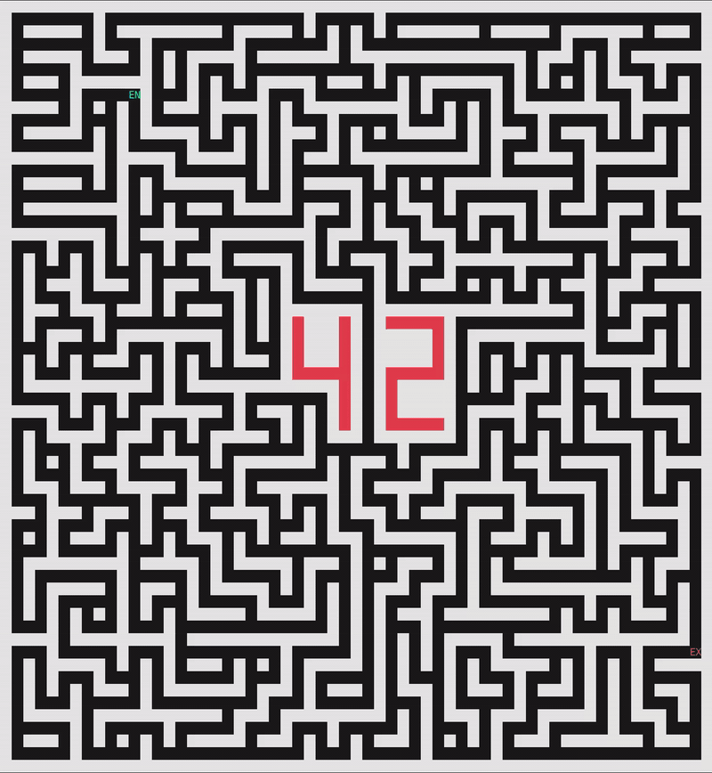
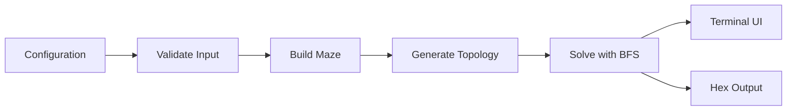
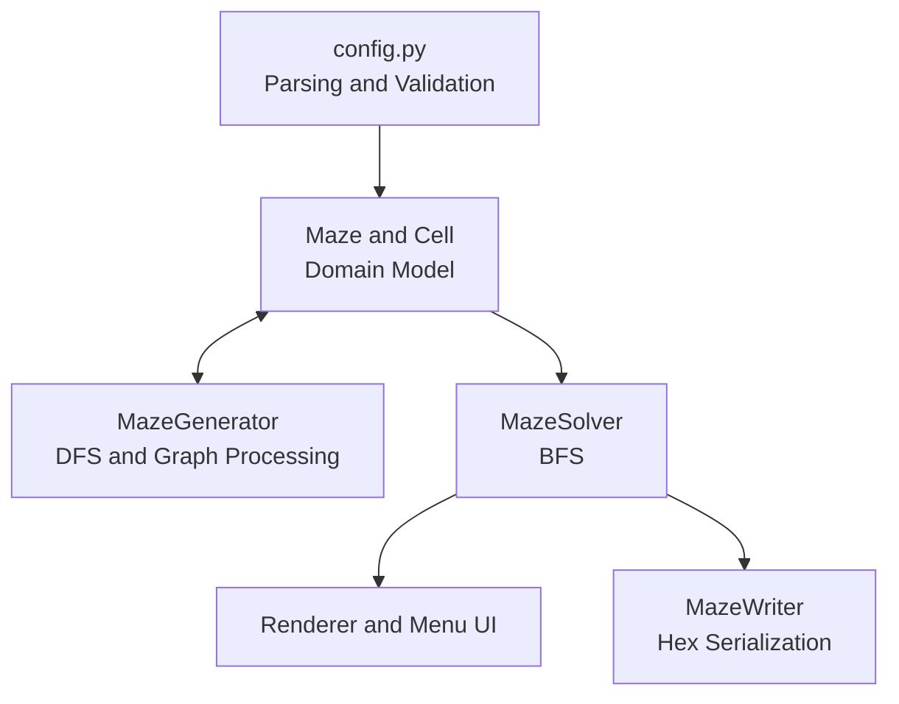

*This project has been created as part of the 42 curriculum by stehoffm and archowdh.*

# A-Maze-ing

A configurable Python maze generator, solver, and terminal visualizer developed as part of the Codam / 42 curriculum.

The project models a maze as a **grid graph**. It combines randomized depth-first search (DFS), breadth-first search (BFS), and graph post-processing to generate either a traditional perfect maze or a connected, loop-containing, dead-end-free playable board.

<p align="center">
  
</p>

## Highlights

- Two generation modes: a perfect maze and a braided, Pac-Man-like board
- Randomized DFS for generation and BFS for shortest-path solving
- Graph-based validation of connectivity, cycles, and dead ends
- Constraint-aware passage creation that prevents oversized open rooms
- Deterministic generation through optional random seeds
- Protected `42` pattern integrated into the maze topology
- Interactive ANSI terminal rendering and hexadecimal serialization
- Reusable `mazegen` package with 37 tests, `mypy`, and `flake8` checks

## Contents

- [How It Works](#how-it-works)
- [My Contribution](#my-contribution)
- [Quick Start](#quick-start)
- [Generation and Solving](#generation-and-solving)
- [Architecture](#architecture)
- [Configuration](#configuration)
- [Output Format](#output-format)
- [Package Usage](#package-usage)
- [Testing](#testing)
- [Team](#team)
- [Development Process and AI Usage](#development-process-and-ai-usage)

## How It Works

A-Maze-ing reads and validates a plain-text configuration, builds the maze, finds the shortest route, renders the result in the terminal, and optionally saves it in the format required by the subject.



The same graph model supports two different maze styles:

| Mode | Graph structure | Cycles | Dead ends | Use case |
|---|---|---:|---:|---|
| `PERFECT=True` | Spanning tree | `0` | Possible | Traditional maze with one route between any two cells |
| `PERFECT=False` | Braided graph | `>= 2` | `0` | More open, Pac-Man-like playable board |

## My Contribution

As `stehoffm`, my main responsibilities were:

- configuration parsing and comprehensive input validation
- terminal rendering and mutable canvas construction
- protected-pattern placement and generation constraints
- playable-board generation and graph post-processing
- connectivity, cycle, dead-end, and open-room validation
- Makefile targets, Python packaging, docstrings, and documentation
- migration from subject version 2.0 to version 2.2 with my teammate

This work focused on turning the initial perfect-maze generator into a robust application with validated inputs, two generation modes, reusable modules, an interactive interface, and automated verification of the subject requirements.

## Quick Start

### Requirements

- Python 3.10+
- `pip`
- `make`

Install the development tools and run the default configuration:

```sh
make install
make run
```

Alternatively, run the entry point directly:

```sh
python3 a_maze_ing.py config.txt
```

Useful commands:

```sh
make test          # Run the test suite
make lint          # Run flake8 and mypy
make package       # Build the wheel and source distribution
make debug         # Run the application with pdb
make clean         # Remove generated caches and build artifacts
```

## Generation and Solving

### Perfect maze generation

Perfect mazes are generated with **randomized DFS / recursive backtracking**. Starting at the configured entry, the generator repeatedly selects an unvisited neighbour, removes the wall between both cells, and backtracks when it reaches a cell with no unvisited neighbours.

The result is a connected spanning tree. For `V` accessible cells and `E` open passages:

```text
E = V - 1
```

A connected tree has no cycles, so there is exactly one path between every pair of accessible cells.

### Playable-board generation

With `PERFECT=False`, the application starts from the DFS tree and adds carefully validated passages. This process:

1. opens required corridors
2. adds at least two independent cycles
3. braids degree-1 vertices to remove dead ends
4. rejects passages that create fully open `3 x 3`, `2 x 4`, or `4 x 2` areas
5. verifies the required cells and protected pattern again

Adding edges preserves the connectedness of the original tree. The number of independent cycles is measured with the cyclomatic number:

```text
cycles = edges - vertices + connected components
```

### Shortest-path solving

The solver uses **BFS** with `collections.deque`. It records the parent of each visited cell and reconstructs the solution by walking backwards from the exit to the entry.

Because every move has equal cost, BFS guarantees a shortest path by number of passages traversed.

### Reproducible generation

Random choices use a dedicated `random.Random(seed)` instance. Providing the same configuration and seed reproduces the same maze without depending on Python's global random state.

## Protected `42` Pattern

The central `42` is part of the maze topology rather than a visual overlay. Pattern cells are locked during carving, while a separate visible-pattern state allows the generator to protect additional cells when necessary without drawing them as part of the `42`.

Pattern placement must preserve the entry, exit, centre, corners, required corridors, and overall maze connectivity.

## Architecture

The project separates the domain model from generation, solving, presentation, and persistence.



| Component | Responsibility |
|---|---|
| `Maze`, `Cell`, `Position`, `Direction` | Grid state, walls, coordinates, and movement |
| `MazeGenerator` | DFS generation and playable-board transformation |
| `MazeSolver` | BFS traversal and path reconstruction |
| `Config` | Parsing, defaults, and validation |
| `Renderer`, `MenuUI` | ANSI visualization and interactive controls |
| `MazeWriter` | Subject-compatible hexadecimal output |

The installed package also exposes the `maze-gen` command-line entry point.

## Configuration

Configuration uses one `KEY=VALUE` pair per line. Empty lines and lines beginning with `#` are ignored.

```ini
WIDTH=30
HEIGHT=30
ENTRY=5,10
EXIT=18,25
OUTPUT_FILE=maze.txt
PERFECT=False
PATTERN=42
SEED=42
WALL_COLOR=DEFAULT
PATH_COLOR=RED
PATTERN_COLOR=CYAN
```

| Key | Required | Description |
|---|:---:|---|
| `WIDTH`, `HEIGHT` | Yes | Positive maze dimensions |
| `ENTRY`, `EXIT` | Yes | Distinct in-bounds `x,y` coordinates |
| `OUTPUT_FILE` | Yes | Destination for the serialized maze |
| `PERFECT` | Yes | Selects perfect or playable-board generation |
| `PATTERN` | No | Protected pattern: `42`, `X`, or `Box` |
| `SEED` | No | Integer seed for deterministic generation |
| `WALL_COLOR`, `PATH_COLOR`, `PATTERN_COLOR` | No | ANSI terminal colours |

Malformed values, duplicate or unknown keys, missing fields, invalid coordinates, unsupported colours, and impossible layouts are rejected with clear error messages.

## Interactive Interface

After generation, the menu can:

1. generate a new maze
2. show or hide the shortest solution
3. change wall, path, and pattern colours
4. save the maze
5. exit

The renderer constructs a mutable terminal canvas, carves passages, and overlays the solution, protected pattern, and `EN` / `EX` markers.

## Output Format

Each cell is serialized as one hexadecimal digit representing its four walls:

| Bit | Wall | Value |
|---:|---|---:|
| `0` | North | `1` |
| `1` | East | `2` |
| `2` | South | `4` |
| `3` | West | `8` |

The grid is followed by the entry, exit, and shortest route. Path characters use `N`, `E`, `S`, and `W`.

Generated files can be checked with the subject-oriented analyser:

```sh
python3 tools/maze_analyzer.py maze.txt
```

## Package Usage

The maze logic is available independently of the interactive application:

```python
from mazegen import Maze, MazeGenerator, MazeSolver, Position

maze = Maze(
    rows=20,
    cols=20,
    pattern_name="42",
    entry=Position(0, 0),
    exit=Position(19, 19),
)

MazeGenerator(seed=42).generate(maze, perfect=True)
solution = MazeSolver().solve(maze)

print(f"Shortest route: {len(solution) - 1} moves")
```

Build the package with:

```sh
make package
```

## Testing

The 37-test suite checks behaviour and mathematical graph properties rather than relying only on visual output.

| Area | Verified properties |
|---|---|
| Perfect mode | One connected component and zero cycles |
| Playable mode | One component, at least two cycles, and zero dead ends |
| Maze model | Coherent shared walls, borders, pattern state, and wall encoding |
| Configuration | Valid parsing and helpful rejection of invalid input |
| Serialization | Hex grid, coordinates, and shortest-path directions |
| Subject constraints | Required positions, room limits, reproducibility, and analyser verdicts |

Quality checks use `pytest`, `mypy`, and `flake8`:

```sh
make test
make lint
```

## Team

A-Maze-ing was developed by `stehoffm` and `archowdh`.

`archowdh` primarily worked on maze-grid initialization, perfect-maze generation, randomized DFS, the BFS solver, menu functionality, solution animation, and alternative locked-cell patterns.

Shared work included the initial `Cell` model, the v2.0-to-v2.2 migration, playable-board constraints, analyser integration, and final validation.

## Development Process and AI Usage

The original version 2.0 implementation was developed by the team from scratch without AI-generated implementation code.

After the subject changed to version 2.2, AI was used selectively to generate candidate implementations for some functions needed by the new and changed requirements. Each suggestion was evaluated against the subject, reviewed for correctness, understood, adapted to the existing architecture, and tested before being incorporated.

AI also supported documentation wording, docstrings, conceptual clarification, and parts of the final subject-oriented test suite. The developers remained responsible for the design decisions, integration, validation, and submitted code.

## Further Improvements

The recursive generator currently raises Python's recursion limit for larger mazes. Replacing recursion with an explicit stack would retain DFS behaviour while avoiding dependence on call-stack depth. Other useful next steps include CI for tests and static analysis, clean-environment installation tests, and performance profiling on very large grids.

## References

- [Python documentation](https://docs.python.org/3/)
- [Depth-first search](https://en.wikipedia.org/wiki/Depth-first_search)
- [Breadth-first search](https://en.wikipedia.org/wiki/Breadth-first_search)
- [Python Packaging User Guide](https://packaging.python.org/)
