*This project has been created as part of the 42 curriculum by stehoffm, archowdh.*

# A-Maze-ing

A configurable Python maze generator and solver developed as part of the Codam / 42 curriculum.

The project treats a maze as a **grid graph**: cells are vertices and open passages are edges. It uses **randomized depth-first search (DFS)** to generate perfect mazes, **breadth-first search (BFS)** to find shortest paths, and graph-based post-processing to transform a spanning tree into a connected, loop-containing, dead-end-free playable board.

<p align="center">
  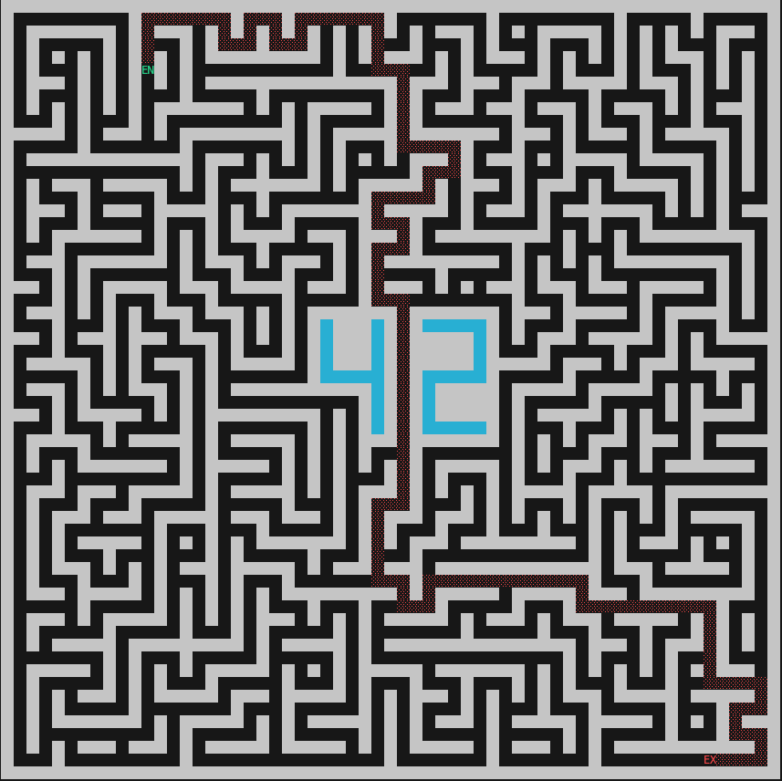
</p>

## Highlights

- **Randomized DFS / recursive backtracking** for procedural maze generation
- **BFS** for shortest-path solving
- Perfect mazes represented as **connected spanning trees**
- Graph post-processing using **vertex degree**, **connected components**, and **cycle analysis**
- Independent cycle counting with the cyclomatic number `E - V + C`
- Dead-end removal through maze **braiding**
- Constraint-aware edge creation that prevents oversized open rooms
- Protected `42` structure integrated into maze generation
- Deterministic generation through seeded pseudorandomness
- Compact **4-bit / hexadecimal wall encoding**
- Validated configuration-file parsing
- ANSI terminal rendering and interactive controls
- Automated testing with `pytest`
- Static analysis with `mypy` and `flake8`
- Reusable installable `mazegen` Python package

---

## Table of Contents

- [Overview](#overview)
- [Maze as a Graph](#maze-as-a-graph)
- [Generation Algorithms](#generation-algorithms)
  - [Perfect Maze Generation](#perfect-maze-generation)
  - [Reproducible Generation](#reproducible-generation)
  - [Playable Board Generation](#playable-board-generation)
  - [Dead Ends and Vertex Degree](#dead-ends-and-vertex-degree)
  - [Cycle Analysis](#cycle-analysis)
  - [Constraint-Preserving Edge Creation](#constraint-preserving-edge-creation)
- [Maze Solving](#maze-solving)
- [Protected 42 Pattern](#protected-42-pattern)
- [Wall Encoding](#wall-encoding)
- [Architecture](#architecture)
- [Running the Project](#running-the-project)
- [Configuration](#configuration)
- [Interactive Interface](#interactive-interface)
- [Output Format](#output-format)
- [Reusable Python Package](#reusable-python-package)
- [Testing and Verification](#testing-and-verification)
- [Project Structure](#project-structure)
- [Team and Contributions](#team-and-contributions)
- [Design Decisions](#design-decisions)
- [Possible Improvements](#possible-improvements)
- [Resources](#resources)
- [AI Usage](#ai-usage)

---

## Overview

A-Maze-ing reads a plain-text configuration file describing the desired maze and then:

1. validates the configuration;
2. creates the maze grid;
3. reserves the protected pattern;
4. generates the maze topology;
5. optionally converts it into a more open playable board;
6. finds the shortest route from entry to exit;
7. renders the maze in the terminal;
8. optionally serializes it to the hexadecimal format required by the project.

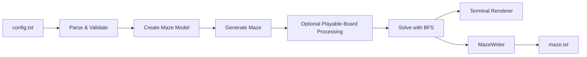

The program supports two main generation modes.

| Mode | Structure | Cycles | Dead Ends | Main Purpose |
|---|---|---:|---:|---|
| `PERFECT=True` | Spanning tree | `0` | Possible | Traditional perfect maze |
| `PERFECT=False` | Braided graph | `>= 2` | `0` | Pac-Man-like playable board |

---

## Maze as a Graph

Although the maze is displayed as walls and corridors, the underlying structure is naturally modeled as a graph.

Each accessible maze cell is a **vertex**.

An open passage between two orthogonally adjacent cells is an **edge**.

```text
        B
        │
        │
A ───── C ───── D
```

In this example:

- `A`, `B`, `C`, and `D` are vertices;
- each open connection is an edge;
- `C` has degree `3`;
- `A`, `B`, and `D` have degree `1`.

This graph representation allows the same internal maze model to support:

- generation;
- shortest-path solving;
- connectivity analysis;
- cycle counting;
- dead-end detection;
- rendering;
- serialization.

### Cell Model

Each `Cell` stores:

- north wall;
- east wall;
- south wall;
- west wall;
- traversal state;
- whether it is locked during generation;
- whether it belongs to the visible protected pattern.

The `Maze` owns a two-dimensional grid of these cells.

---

# Generation Algorithms

## Perfect Maze Generation

Perfect maze generation uses **recursive backtracking**, implemented as a randomized depth-first search.

Starting from the configured entry cell, the algorithm:

1. marks the current cell as visited;
2. finds all unvisited accessible neighbours;
3. shuffles those neighbours;
4. removes the wall between the current cell and a selected neighbour;
5. recursively visits that neighbour;
6. backtracks when no unvisited neighbours remain.

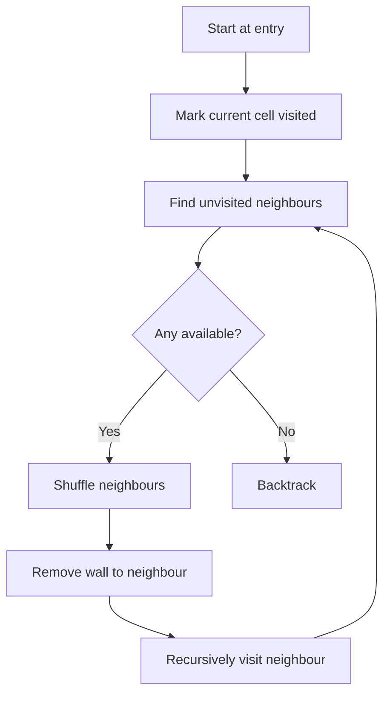

The traversal creates a **spanning tree** over all reachable unlocked cells.

For a connected tree:

\[
E = V - 1
\]

where:

- `V` is the number of accessible cells;
- `E` is the number of open passages between cells.

A tree is connected and contains no cycles.

Therefore a perfect maze has exactly one graph path between any two accessible cells.

### Why DFS / Recursive Backtracking?

This approach works well for the project because:

- it naturally produces perfect mazes;
- it maps cleanly onto the cell-and-wall data model;
- it is straightforward to modify around protected cells;
- randomized neighbour order creates different mazes;
- seeded randomness makes generated layouts reproducible.

---

## Reproducible Generation

Random decisions are performed through a dedicated:

```python
random.Random(seed)
```

instance rather than relying on Python's global random state.

For example:

```txt
SEED=42
```

allows the same sequence of maze-generation decisions to be reproduced when the other inputs remain unchanged.

This provides:

- deterministic debugging;
- reproducible tests;
- isolation from unrelated calls to the global random generator.

---

## Playable Board Generation

`PERFECT=False` starts with the DFS-generated spanning tree but then modifies the graph to create a more open, Pac-Man-like layout.

The process is:

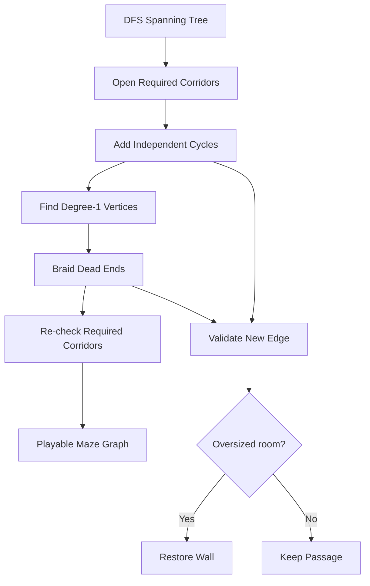

The playable-board mode is designed to preserve several invariants simultaneously:

- the maze remains connected;
- the four corners remain playable;
- the centre remains playable;
- at least two independent cycles exist;
- corridor dead ends are removed;
- the protected pattern remains intact;
- oversized open rooms are avoided.

Because the algorithm **adds edges** to an already connected DFS tree rather than removing its existing passages, the underlying connectivity is preserved.

---

## Dead Ends and Vertex Degree

The degree of a graph vertex is the number of edges connected to it.

For maze cells:

| Degree | Interpretation |
|---:|---|
| `0` | Isolated cell |
| `1` | Dead end |
| `2` | Corridor |
| `3+` | Junction |

Playable-board generation searches for vertices with degree `1`.

For each dead end, it tries to open an additional neighbouring wall.

Conceptually:

```text
Before:

A ─── B

degree(B) = 1


After braiding:

A ─── B
      │
      C

degree(B) = 2
```

This process is commonly called **maze braiding**.

Candidate passages are not opened blindly. They are checked against the structural constraints of the board before being retained.

---

## Cycle Analysis

A perfect maze is a tree and therefore contains no cycles.

Playable mode deliberately introduces cycles to create alternative routes.

The program calculates the number of independent cycles using the graph **cyclomatic number**:

\[
M = E - V + C
\]

where:

- `E` = number of edges;
- `V` = number of vertices;
- `C` = number of connected components.

For a connected tree:

\[
C = 1
\]

and:

\[
E = V - 1
\]

therefore:

\[
M = (V - 1) - V + 1 = 0
\]

Playable mode adds valid edges until the maze has at least two independent cycles.

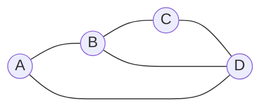

Unlike a tree, this structure provides multiple possible routes between vertices.

---

## Constraint-Preserving Edge Creation

Adding too many passages can stop the structure from looking or behaving like a maze.

Before permanently opening a candidate wall, the generator checks whether the resulting layout creates an oversized completely open area.

The implementation detects open regions of:

- `3 x 3`;
- `2 x 4`;
- `4 x 2`.

If a candidate wall creates one of these areas, the wall is restored.

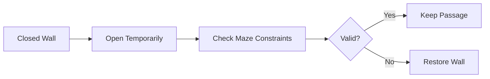

This allows additional graph connectivity without turning large sections of the maze into unrestricted empty rooms.

---

# Maze Solving

The shortest path from entry to exit is found using **breadth-first search (BFS)**.

The solver uses:

```python
collections.deque
```

as the BFS queue.

It also stores predecessor relationships:

```python
parents[child] = parent
```

which are later used to reconstruct the final route.

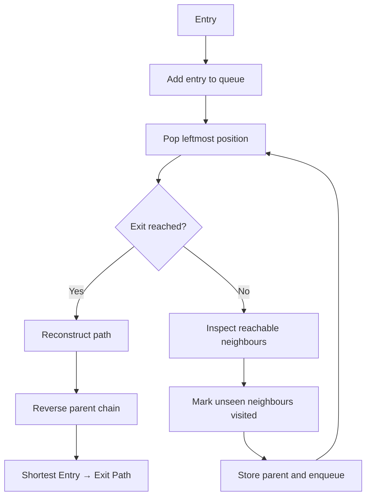

BFS explores vertices by increasing distance from the starting point.

Because every maze movement has the same cost, BFS guarantees a shortest path in terms of the number of traversed edges.

### Path Reconstruction

Suppose BFS creates:

```text
parents[D] = C
parents[C] = B
parents[B] = A
parents[A] = None
```

Starting from `D`, the solver walks backwards:

```text
D → C → B → A
```

and reverses the result:

```text
A → B → C → D
```

to obtain the entry-to-exit path.

---

# Protected `42` Pattern

The maze contains a protected visual `42` structure.

Cells belonging to the pattern are prevented from participating normally in maze carving.

The implementation distinguishes between:

- visible pattern cells;
- additional generation-locked cells;
- normal playable cells.

This distinction allows generation logic to protect the required shape without forcing every generation constraint to appear visually as part of the `42`.

Pattern placement must coexist with the other graph requirements:

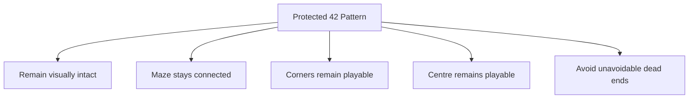

The pattern is therefore not merely a rendering overlay. It influences the topology that the generator is allowed to create.

---

# Wall Encoding

Each cell has four Boolean wall states.

The serialized maze represents these walls as four bits:

| Bit | Direction | Decimal Value |
|---:|---|---:|
| `0` | North | `1` |
| `1` | East | `2` |
| `2` | South | `4` |
| `3` | West | `8` |

A **closed wall** sets its corresponding bit.

An **open wall** leaves the bit unset.

### Example: North + East

```text
West South East North
  0     0    1    1

Binary:      0011
Decimal:        3
Hexadecimal:    3
```

### Example: East + West

```text
West South East North
  1     0    1    0

Binary:      1010
Decimal:       10
Hexadecimal:    A
```

Because there are only four wall states, each cell fits into a single hexadecimal digit.

---

# Architecture

The project separates the domain model, generation algorithms, solving, configuration, presentation and serialization.

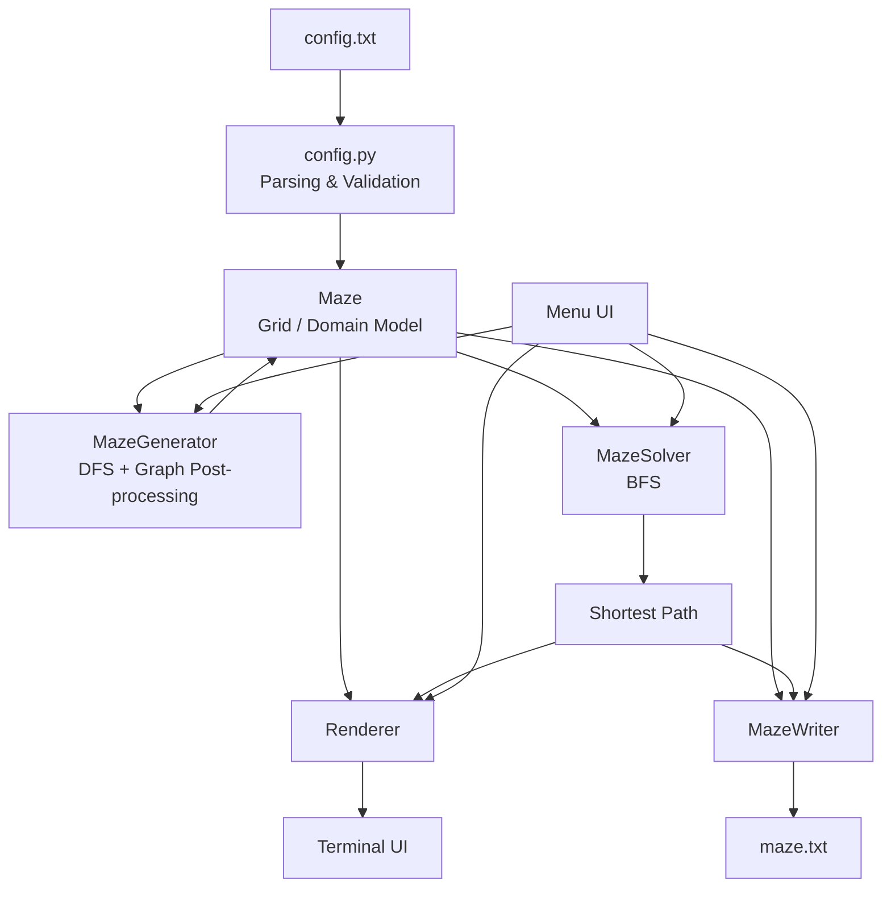

## Main Components

| Module | Responsibility |
|---|---|
| `cell.py` | Wall state, traversal state, pattern state and hex encoding |
| `position.py` | Grid-coordinate representation |
| `direction.py` | Orthogonal movement directions |
| `maze.py` | Grid ownership, topology and neighbour operations |
| `maze_generator.py` | DFS generation and playable-board transformation |
| `maze_solver.py` | BFS shortest-path solving |
| `config.py` | Parsing and validation |
| `renderer.py` | ANSI terminal visualization |
| `maze_writer.py` | Output serialization |
| `menu_ui.py` | Interactive application controls |
| `cli.py` | Command-line application entry point |

This separation keeps the maze algorithms independent from rendering and persistence concerns.

---

# Running the Project

## Requirements

- Python 3.10+
- `pip`
- `make`

### Install Development Tools

```sh
make install
```

### Run

```sh
make run
```

or:

```sh
python3 a_maze_ing.py config.txt
```

### Debug

```sh
make debug
```

### Static Analysis

```sh
make lint
```

This runs the configured linting and type-checking tools.

### Tests

```sh
make test
```

### Validate Generated Output

```sh
python3 tools/maze_analyzer.py maze.txt
```

### Clean Generated Cache Files

```sh
make clean
```

---

# Configuration

The configuration file contains one:

```text
KEY=VALUE
```

pair per line.

Empty lines and lines beginning with `#` are ignored.

Example:

```txt
# Default A-Maze-ing configuration

WIDTH=30
HEIGHT=20

ENTRY=1,1
EXIT=29,14

OUTPUT_FILE=maze.txt

PERFECT=False
PATTERN=42
SEED=

WALL_COLOR=DEFAULT
PATH_COLOR=RED
PATTERN_COLOR=CYAN
```

## Required Values

| Key | Format | Description |
|---|---|---|
| `WIDTH` | Positive integer | Maze width in cells |
| `HEIGHT` | Positive integer | Maze height in cells |
| `ENTRY` | `x,y` | Entry coordinates |
| `EXIT` | `x,y` | Exit coordinates |
| `OUTPUT_FILE` | Path | Destination for serialized maze |
| `PERFECT` | `True` / `False` | Select generation mode |

## Optional Values

| Key | Default | Description |
|---|---|---|
| `PATTERN` | `42` | Protected pattern |
| `SEED` | Empty | Reproducible random seed |
| `WALL_COLOR` | `DEFAULT` | Wall rendering colour |
| `PATH_COLOR` | `RED` | Solution-path colour |
| `PATTERN_COLOR` | `CYAN` | Protected-pattern colour |

Supported colours:

- `BLACK`
- `RED`
- `GREEN`
- `YELLOW`
- `BLUE`
- `MAGENTA`
- `CYAN`
- `WHITE`
- `DEFAULT`

## Coordinate Representation

The configuration file uses:

```text
x,y
```

while the internal model uses:

```text
row,column
```

Therefore:

```txt
ENTRY=1,4
```

becomes:

```text
row = 4
column = 1
```

inside the program.

---

# Interactive Interface

After startup, the application provides an interactive terminal menu.

Available actions include:

1. generate a new maze;
2. show the shortest solution;
3. hide the solution;
4. change wall, path and pattern colours;
5. save the maze;
6. exit.

The renderer builds a mutable terminal canvas and then overlays:

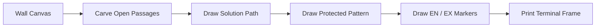

The entry and exit are displayed as:

```text
EN
EX
```

The solution is rendered as a coloured shaded path, and the protected pattern may use a separate ANSI colour.

---

# Output Format

The output file stores the maze row by row.

Each cell is represented by its hexadecimal wall value.

After the grid, an empty line is followed by:

1. entry coordinates;
2. exit coordinates;
3. shortest-path directions.

The path uses:

| Character | Direction |
|---|---|
| `N` | North |
| `E` | East |
| `S` | South |
| `W` | West |

For example:

```text
EESSENNWS
```

represents a sequence of moves from the maze entry toward the exit.

---

# Reusable Python Package

The reusable code is packaged as the Python distribution:

```text
mazegen
```

Example:

```python
from mazegen import Maze, MazeGenerator, MazeSolver, Position

maze = Maze(
    rows=20,
    cols=20,
    pattern_name="42",
    entry=Position(0, 0),
    exit=Position(19, 19),
)

generator = MazeGenerator(seed=42)
generator.generate(maze, perfect=True)

solution = MazeSolver().solve(maze)

print(len(solution))
```

The generator mutates the provided `Maze` object in place.

Generation and solving operate on the internal domain model rather than the serialized file representation.

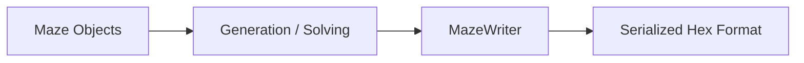

This keeps algorithmic logic independent from persistence.

## Build the Package

```sh
make package
```

The build produces package artifacts under:

```text
dist/
```

A generated wheel can then be installed into another environment:

```sh
python3 -m pip install dist/mazegen-2.2.0-py3-none-any.whl
```

The installed distribution exposes the CLI command:

```sh
maze-gen
```

Build metadata and package discovery are configured through:

```text
pyproject.toml
```

using `setuptools`.

---

# Testing and Verification

The repository contains automated tests for both internal behaviour and project-level constraints.

## Graph Invariants

Perfect mode is tested for:

| Property | Expected |
|---|---:|
| Connected components | `1` |
| Independent cycles | `0` |

Playable mode is tested for:

| Property | Expected |
|---|---:|
| Connected components | `1` |
| Independent cycles | `>= 2` |
| Dead ends | `0` |

These tests check mathematical properties of the generated graph rather than only comparing visual output.

## Additional Coverage

Tests also cover:

- maze-model behaviour;
- wall manipulation;
- required playable positions;
- protected-pattern constraints;
- configuration parsing;
- output formatting;
- invalid layouts;
- subject-specific requirements.

The project uses:

| Tool | Purpose |
|---|---|
| `pytest` | Runtime and behavioural tests |
| `mypy` | Static type checking |
| `flake8` | Style and lint checks |
| `maze_analyzer.py` | Subject-specific output validation |

Run tests with:

```sh
make test
```

Run static checks with:

```sh
make lint
```

---

# Project Structure

```text
A_MAZE_ING/
│
├── a_maze_ing.py
├── config.txt
├── Makefile
├── pyproject.toml
├── pytest.ini
├── README.md
│
├── docs/
│   └── maze-demo.png
│
├── src/
│   └── mazegen/
│       ├── __init__.py
│       ├── __main__.py
│       ├── cell.py
│       ├── cli.py
│       ├── config.py
│       ├── direction.py
│       ├── maze.py
│       ├── maze_generator.py
│       ├── maze_solver.py
│       ├── maze_writer.py
│       ├── menu_ui.py
│       ├── position.py
│       └── renderer.py
│
├── tests/
│   ├── test_maze_model.py
│   ├── test_playable_board.py
│   └── test_subject_constraints.py
│
└── tools/
    └── maze_analyzer.py
```

---

# Team and Contributions

A-Maze-ing was developed as a two-person Codam / 42 project by `stehoffm` and `archowdh`.

## `stehoffm`

Primary work included:

- complete configuration parsing and validation;
- terminal rendering and canvas construction;
- protected-pattern implementation;
- locking cells involved in pattern generation;
- playable-board generation;
- graph post-processing for playable mode;
- Makefile and development tooling;
- Python packaging;
- docstrings;
- README and project documentation.

## `archowdh`

Primary work included:

- maze-grid initialization;
- perfect-maze generation;
- randomized DFS / recursive backtracking;
- BFS shortest-path solver;
- interactive menu functionality;
- terminal solution animation;
- alternative locked-cell patterns.

## Shared Work

Both developers contributed to:

- the initial `Cell` data model;
- migration from subject version 2.0 to version 2.2;
- playable-board constraints;
- analyser integration;
- final testing and validation.

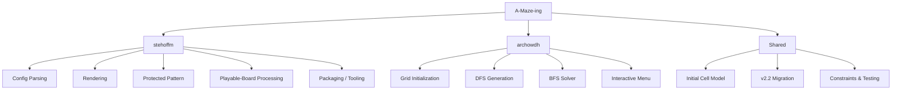

---

# Design Decisions

## Separation of Domain Model and Serialization

The internal maze representation is intentionally independent from the required output format.

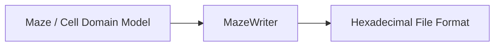

This means maze generation and graph traversal do not need to understand how the final file is formatted.

---

## Separation of Generation and Solving

`MazeGenerator` changes maze topology.

`MazeSolver` traverses an already-generated topology.

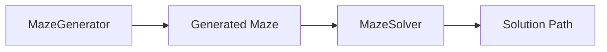

This separation keeps two fundamentally different responsibilities independent.

---

## Dedicated Configuration Layer

Raw text configuration is converted into a validated `Config` object before the rest of the application uses it.

Validation includes:

- unknown syntax;
- duplicate keys;
- missing required fields;
- invalid numbers;
- malformed coordinates;
- out-of-bounds positions;
- invalid booleans;
- invalid colours;
- identical entry and exit positions.

This gives the rest of the program a stronger invariant:

> once configuration loading succeeds, the application receives structured and validated configuration data.

---

## Explicit Domain Objects

Instead of representing everything with loosely related tuples and lists, the project uses dedicated concepts such as:

- `Maze`;
- `Cell`;
- `Position`;
- `Direction`;
- `MazeGenerator`;
- `MazeSolver`;
- `MazeWriter`;
- `Renderer`.

This makes ownership and responsibilities more explicit and keeps algorithmic code easier to reason about.

---

# Possible Improvements

Possible future improvements include:

- additional end-to-end tests for the interactive terminal interface;
- clean-environment package-install tests;
- continuous integration for tests, linting and type checking;
- profiling generation performance on very large mazes;
- benchmarking recursive DFS against an iterative implementation;
- clearer separation of mandatory and optional protected patterns.

One particularly relevant improvement would be replacing recursive generation with an explicit stack for very large grids.

The current generator increases Python's recursion limit:

```python
sys.setrecursionlimit(20000)
```

An iterative DFS could preserve the same traversal behaviour while avoiding dependence on Python call-stack depth.

---

# Resources

References used while developing and studying the project include:

- [Python Documentation](https://docs.python.org/3/)
- [Python `collections.deque`](https://docs.python.org/3/library/collections.html#collections.deque)
- [Python `random`](https://docs.python.org/3/library/random.html)
- [Python Packaging User Guide](https://packaging.python.org/)
- [Depth-first search](https://en.wikipedia.org/wiki/Depth-first_search)
- [Breadth-first search](https://en.wikipedia.org/wiki/Breadth-first_search)
- [Randomized DFS maze-generation reference](https://medium.com/@nacerkroudir/randomized-depth-first-search-algorithm-for-maze-generation-fb2d83702742)
- [BFS maze-solving reference](https://medium.com/@luthfisauqi17_68455/artificial-intelligence-search-problem-solve-maze-using-breadth-first-search-bfs-algorithm-255139c6e1a3)
- [MIT License](https://opensource.org/license/mit)

The project also uses the analyser supplied with the Codam / 42 subject to validate generated output and project-specific constraints.

---

# AI Usage

AI was used as a **supporting tool**, not as a replacement for implementing or understanding the project.

It was used for:

- improving documentation wording;
- improving docstrings;
- clarifying concepts such as terminal-canvas rendering;
- assisting with the final subject-oriented test suite after the main implementation was complete.

AI support was also used while creating parts of:

```text
tests/test_subject_constraints.py
```

to help verify:

- configuration parsing;
- output formatting;
- generated-maze constraints;
- analyser verdicts.

Generated suggestions were reviewed, understood and adapted before being incorporated into the repository.
